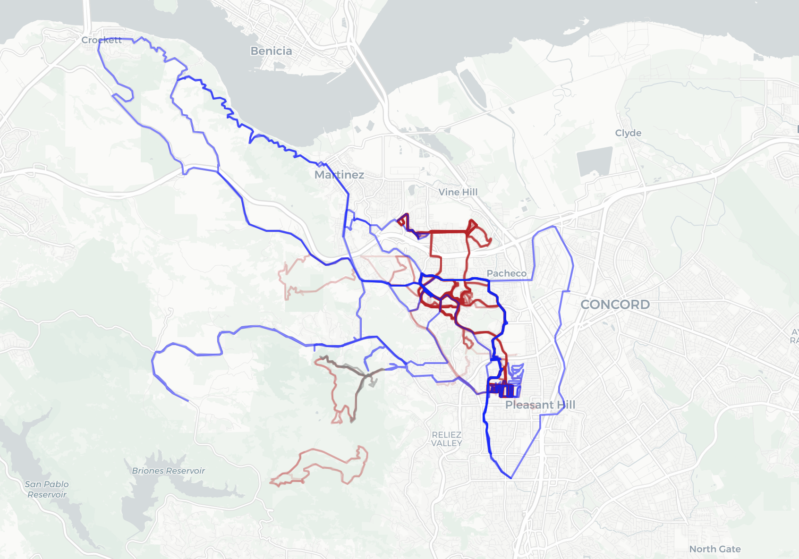

# 30DayMapChallenge - Strava Activities Visualization

A Python application that creates an interactive visualization of Strava activities using the Strava API and Folium maps.



## Requirements

- Python 3.x
- Required packages:
  - folium
  - polyline
  - requests

## Setup

1. Create a Strava API application at https://www.strava.com/settings/api
2. Set environment variables:
   ```bash
   export STRAVA_CLIENT_ID="your_client_id"
   export STRAVA_CLIENT_SECRET="your_client_secret"
   ```

## Usage

1. Run the authorization script:
   ```bash
   python get_strava_data.py
   ```
2. Visit the authorization URL when prompted
3. Copy the authorization code and update the script
4. The script will generate an `activities_map.html` file with your visualized activities

## Project Structure

- `globals.py`: API endpoints and configuration
- `get_strava_data.py`: Main script for authorization and data retrieval
- `utils.py`: Helper functions for data processing and map creation

