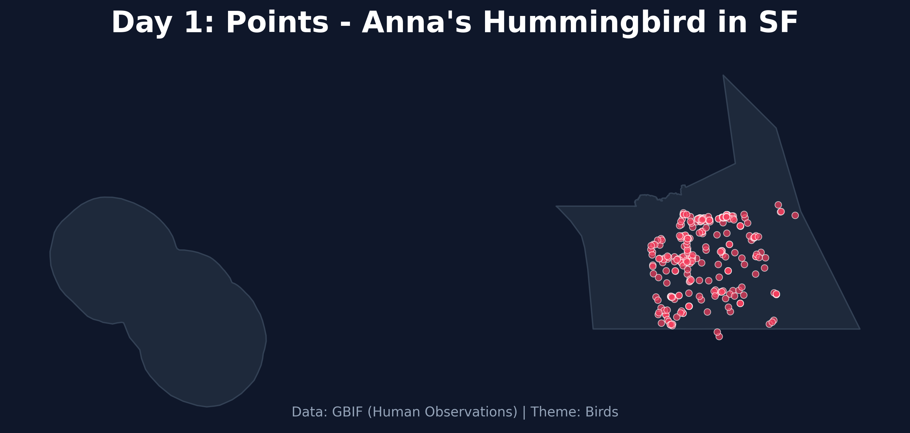

# Day 1: Points
A point map showing recent human observations of **Anna's Hummingbird** (*Calypte anna*) in San Francisco, sourced from the Global Biodiversity Information Facility (GBIF).

## Visualization

