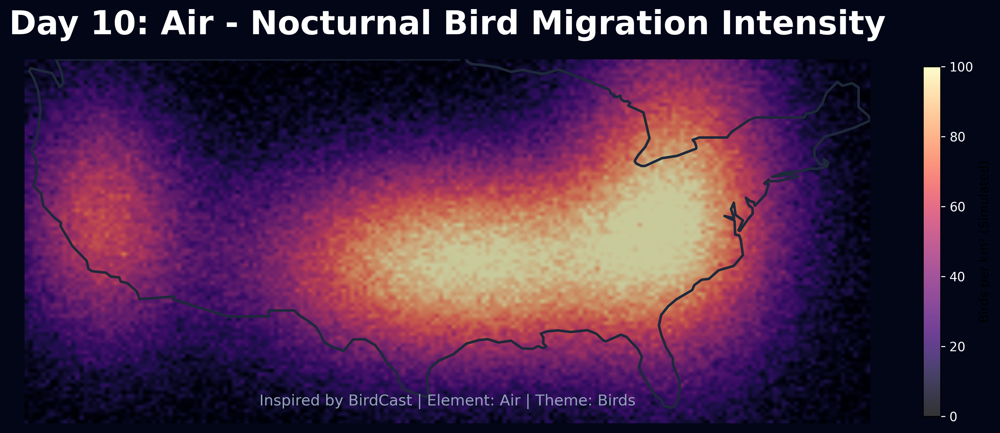

# Day 10: Air (Classical Elements 2/4)
A continental-scale heatmap of simulated **Nocturnal Bird Migration Intensity** over the United States. Inspired by BirdCast, this map visualizes the massive pulses of birds taking to the air during peak migration nights.

## Visualization

