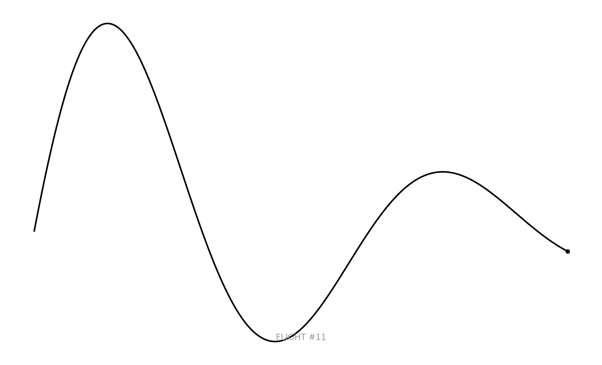

# Day 11: Minimal map
A radical minimalist representation of a bird's flight trajectory. This "map" consists of a single line capturing the rhythmic oscillation of a wingbeat as it transitions into a glide.

## Visualization

