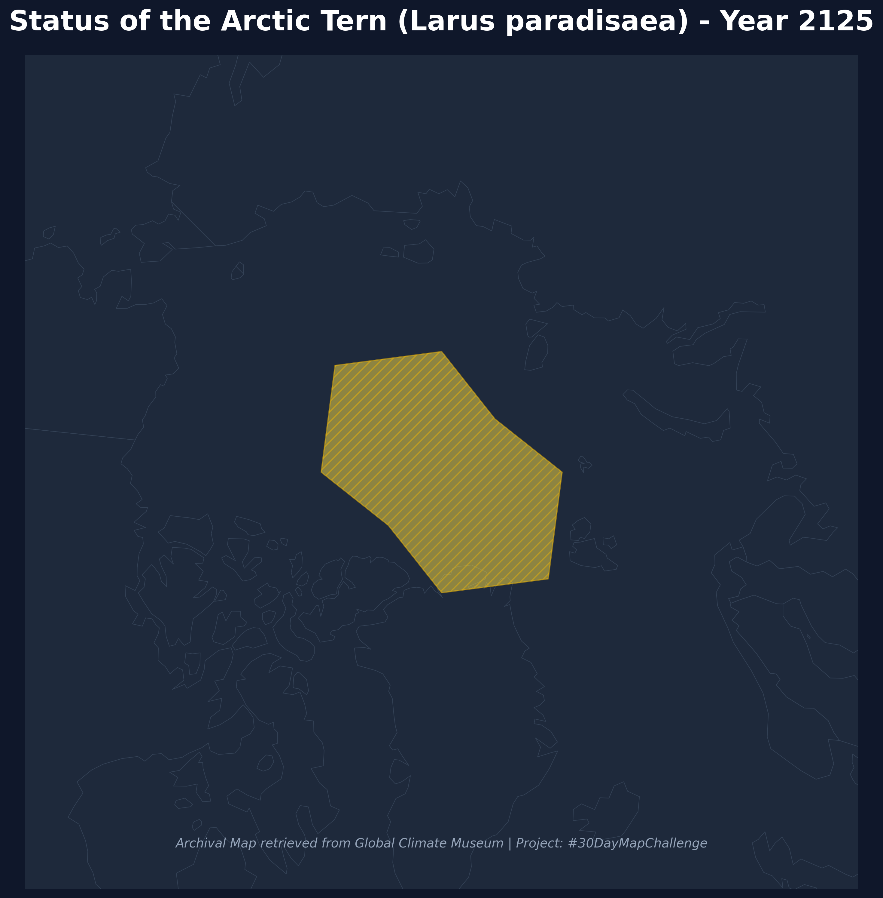

# Day 12: Map from 2125
A speculative "historical" map from the year 2125, visualizing the drastically reduced breeding range of the Arctic Tern. As the Arctic warms, this species is forced into a narrow and fragmented band around the high-latitude islands near the North Pole.

## Visualization

