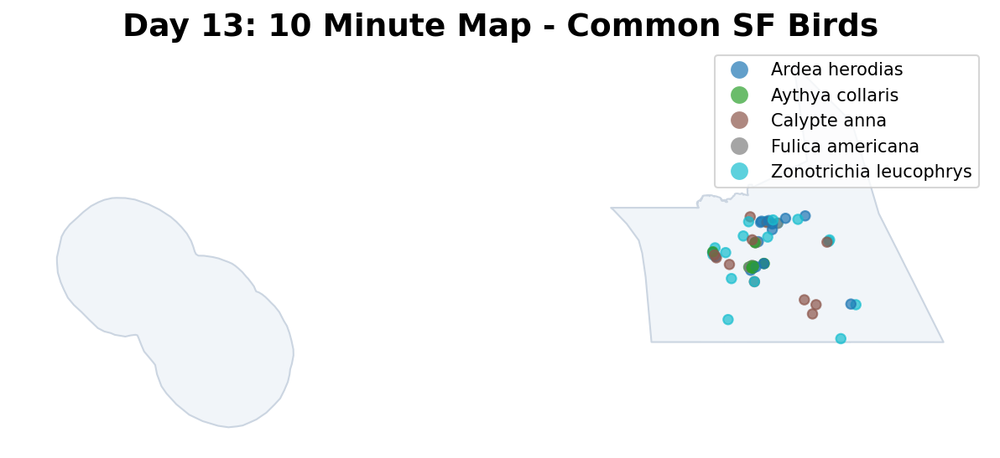

# Day 13: 10 minute map
A rapidly generated map showing a sample of the most common bird species found in San Francisco, based on recent GBIF observations. This map was created in under 10 minutes to demonstrate quick spatial data processing.

## Visualization

