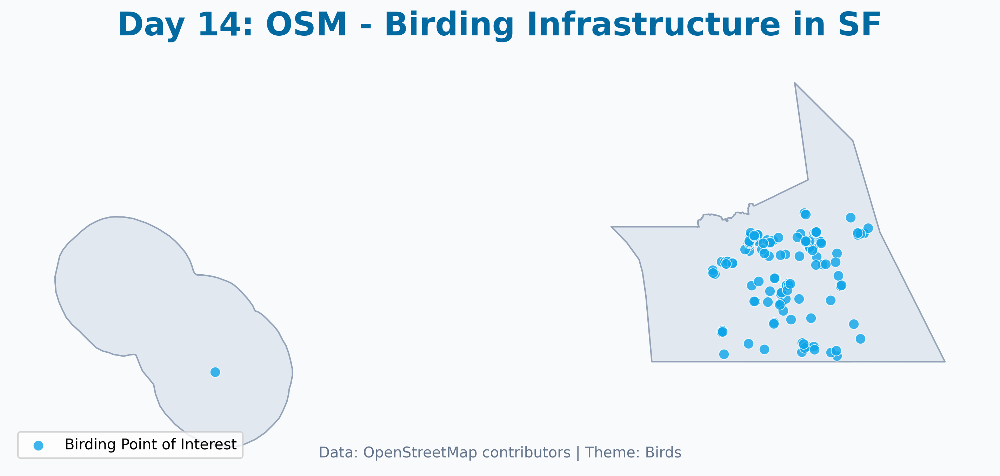

# Day 14: Data challenge: OpenStreetMap
A map of birding-related infrastructure and points of interest in San Francisco, extracted from OpenStreetMap. This includes features tagged as bird hides, observation towers, viewpoints, and known nest sites.

## Visualization

