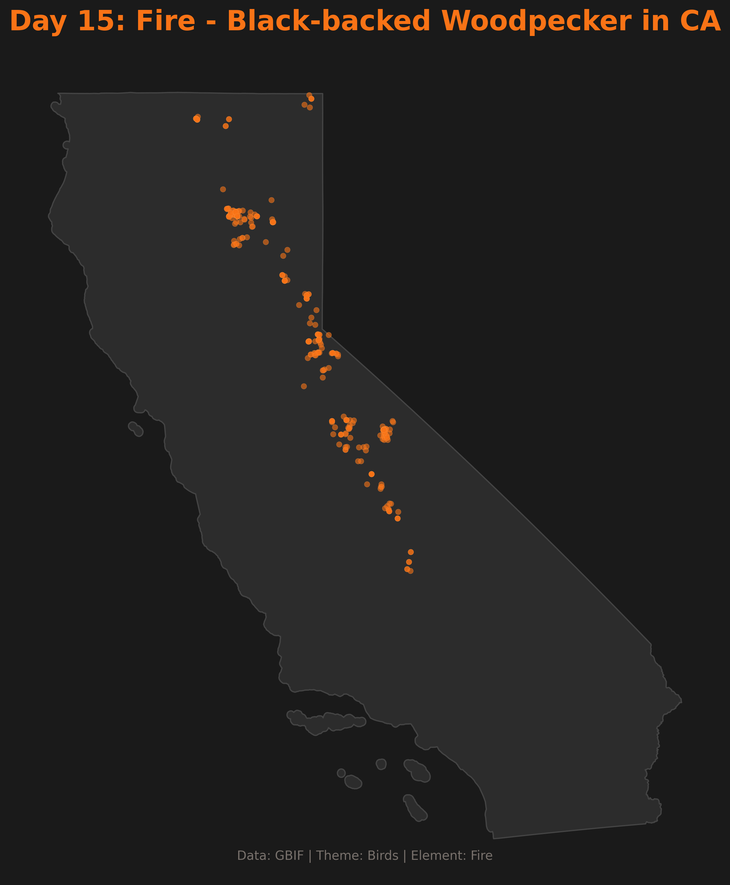

# Day 15: Fire (Classical Elements 3/4)
A distribution map of the **Black-backed Woodpecker** (*Picoides arcticus*) in California. This species is a fire specialist, heavily dependent on recently burned forests where it feeds on wood-boring beetle larvae. This visualization highlights the ecological relationship between wildfire and specialized avian biodiversity.

## Visualization

