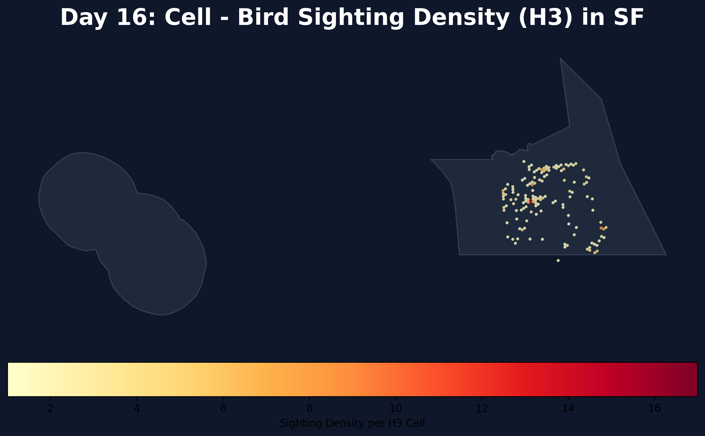

# Day 16: Cell
A visualization of bird sighting density in San Francisco, binned into hexagonal **H3 Cells** (resolution 9). This map abstracts thousands of individual observation points into a regular grid, highlighting the most active "cells" for urban birdwatching.

## Visualization

