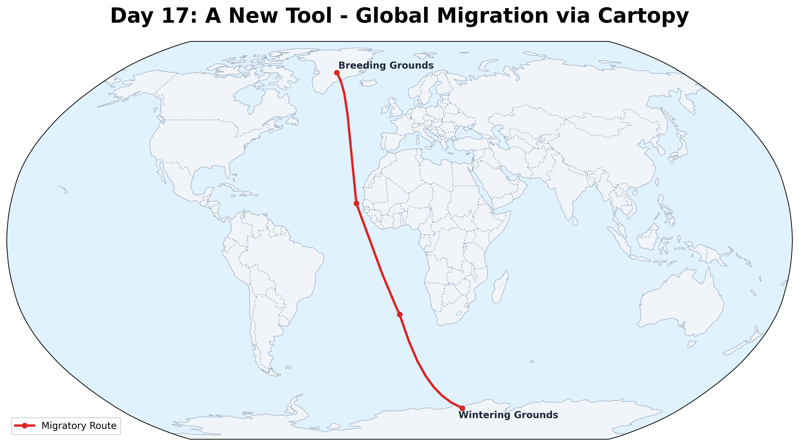

# Day 17: A new tool
A global migration map created using **Cartopy**, a powerful Python library for cartographic projections and geospatial data visualization. This "new tool" allows for sophisticated planetary-scale mapping, here showing a representative pole-to-pole migratory journey in a Robinson projection.

## Visualization

