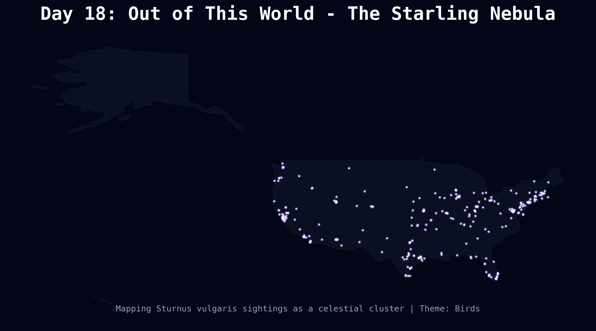

# Day 18: Out of this world
A "cosmic" visualization of **Common Starling** (*Sturnus vulgaris*) sightings across the United States. Playing on their name, the sightings are plotted with a glowing, star-like aesthetic against a deep space background, imagining the distribution as a galactic nebula.

## Visualization

