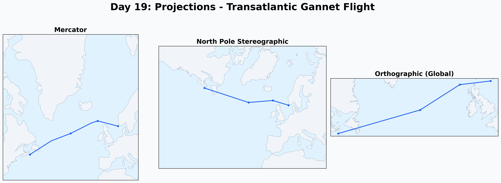

# Day 19: Projections (GIS Day)
A comparison of three different map projections (Mercator, North Pole Stereographic, and Orthographic) showing the same transatlantic migratory path of a Northern Gannet. This visualization explores how projection choice influences our understanding of spatial relationships and the geometry of flight across the globe.

## Visualization

