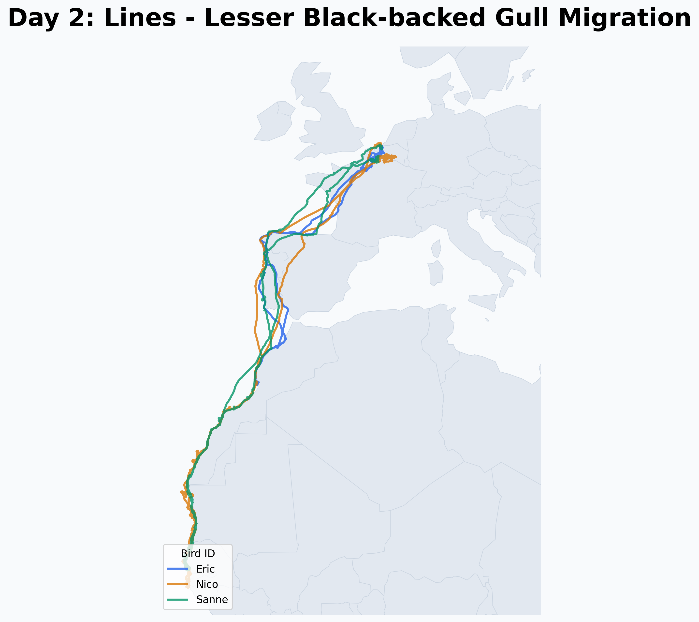

# Day 2: Lines
A map visualizing the migratory trajectories of three Lesser Black-backed Gulls (Eric, Nico, and Sanne), tracked via GPS. Data originated from the LifeWatch INBO bird tracking network and is part of the extensive telemetry datasets available on the **Movebank** global repository for animal movement.

## Visualization

