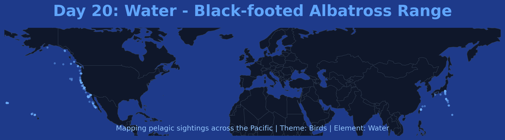

# Day 20: Water (Classical Elements 4/4)
A distribution map of the **Black-footed Albatross** (*Phoebastria nigripes*) across the North Pacific Ocean. These pelagic birds live almost entirely on the open water, returning to land only for breeding. This visualization celebrates the fourth classical element through the range of an ocean-bound species.

## Visualization

