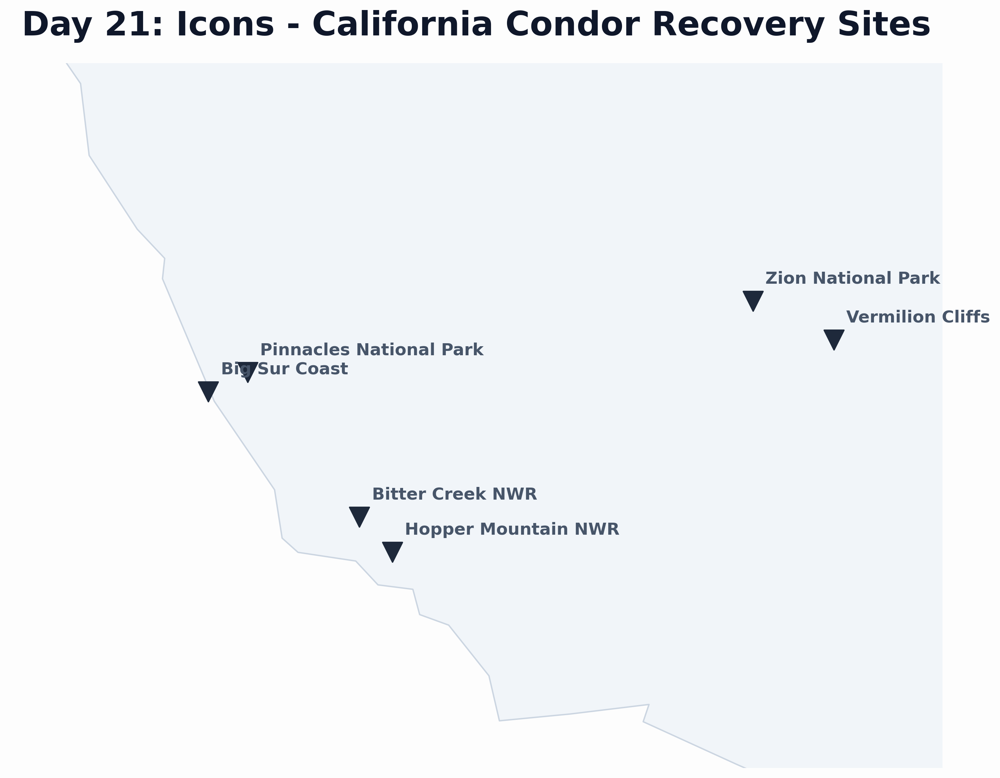

# Day 21: Icons
A map of critical recovery and release sites for the **California Condor** (*Gymnogyps californianus*). The map uses stylized markers to denote key locations in California and Arizona where these birds have been reintroduced to the wild.

## Visualization

