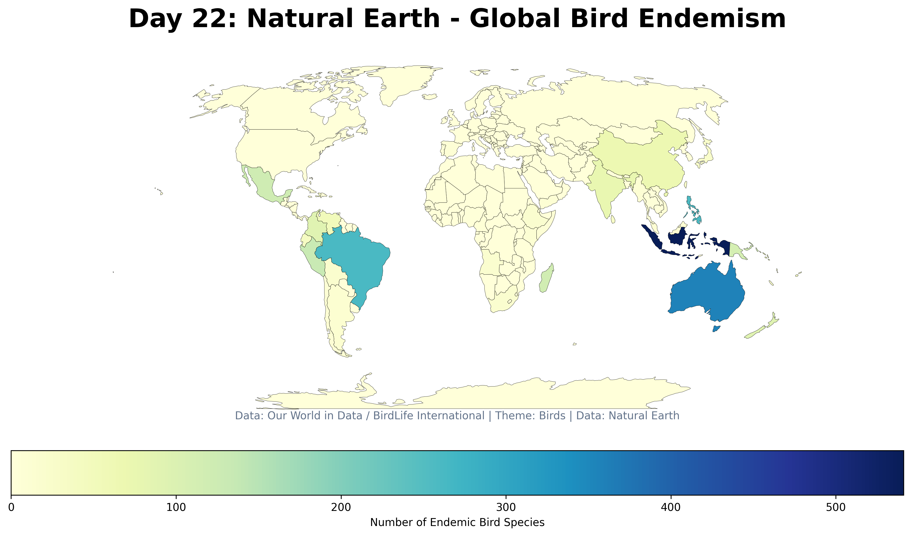

# Day 22: Data challenge: Natural Earth
A global choropleth map visualizing the richness of endemic bird species by country. Using Natural Earth boundaries and data from BirdLife International (via Our World in Data), this map highlights countries with unique avian biodiversity found nowhere else on Earth.

## Visualization

