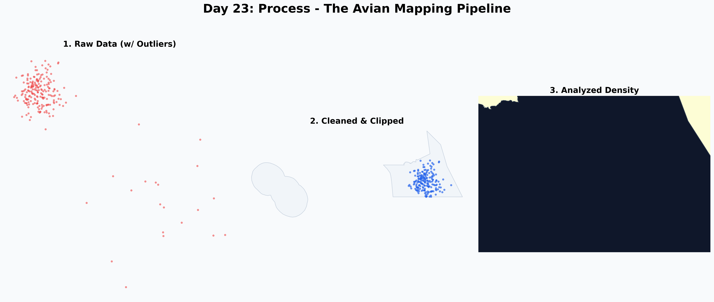

# Day 23: Process
A meta-map visualizing the "process" of turning raw biodiversity sightings into an analyzed density surface. The three panels show: 1) Raw input data with spatial outliers, 2) Cleaned data clipped to a study area, and 3) A final density visualization using Kernel Density Estimation.

## Visualization

