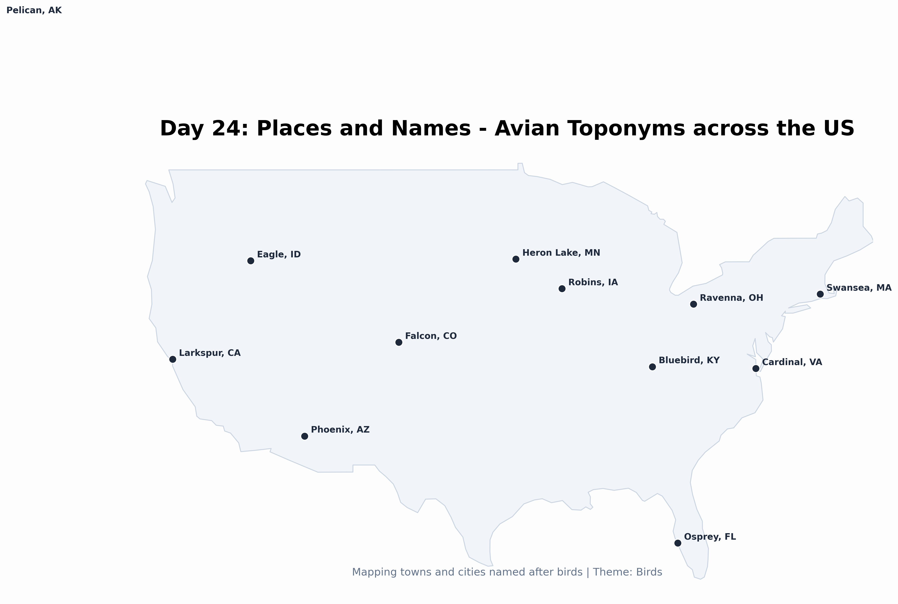

# Day 24: Places and their names
A map of towns and cities across the United States named after birds (toponyms). From Eagle, Idaho to Osprey, Florida, this visualization explores how avian species have left their mark on our geographic naming conventions.

## Visualization

