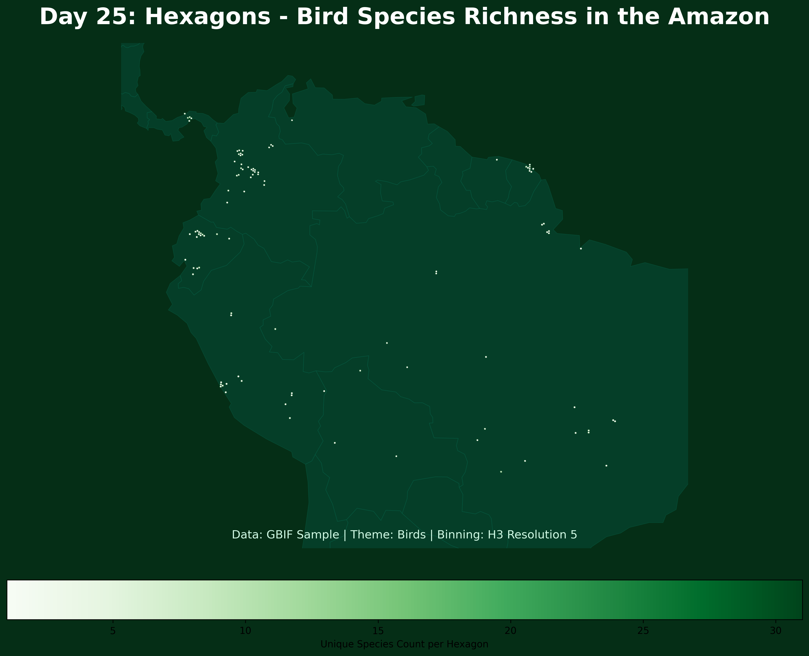

# Day 25: Hexagons
A hexagonal binning map visualizing bird species richness in the Amazon Rainforest. Using the H3 spatial index, a broad sample of sightings is aggregated into regular hexagons, revealing high-biodiversity "hotspots" within the basin.

## Visualization

