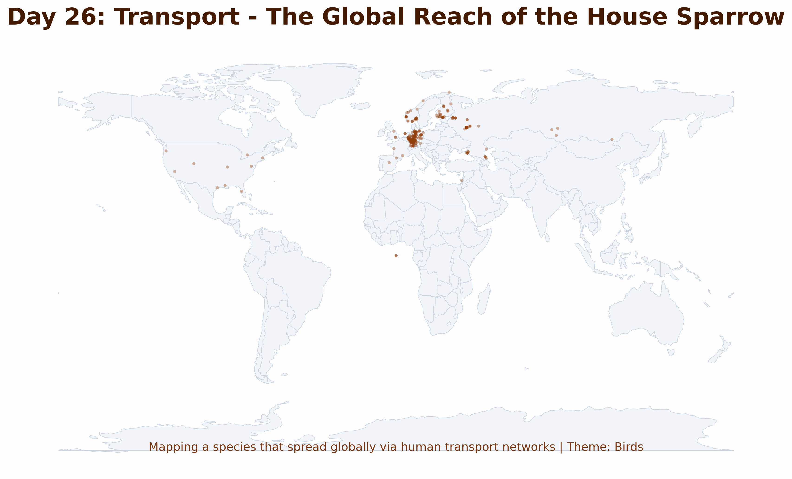

# Day 26: Transport
A global distribution map of the **House Sparrow** (*Passer domesticus*). This species is one of the most successful urban birds, having spread across the globe primarily by hitching rides on human transport infrastructure—from early wooden ships to modern rail and shipping networks.

## Visualization

