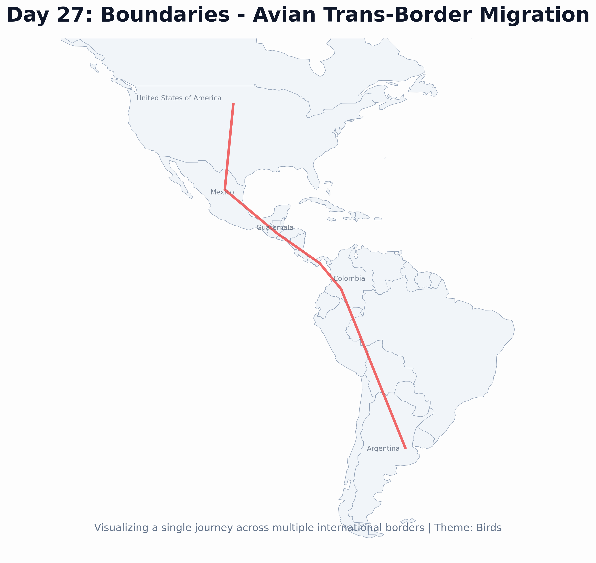

# Day 27: Boundaries
A map illustrating the trans-border migratory path of a **Swainson's Hawk**. This visualization emphasizes how migratory birds ignore political boundaries as they travel thousands of miles across different nations, highlighting the necessity of international cooperation in wildlife conservation.

## Visualization

