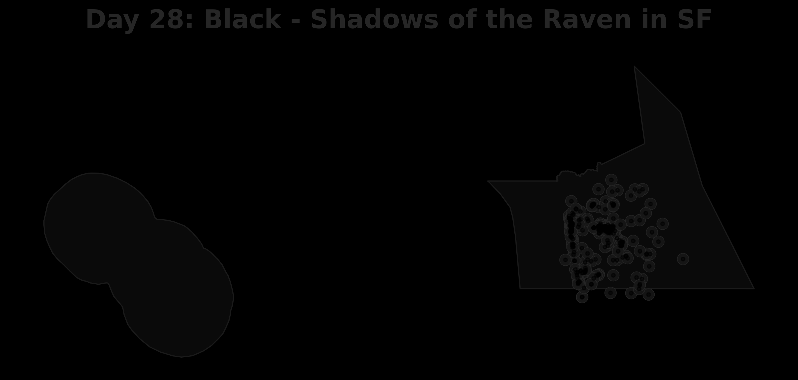

# Day 28: Black
A radical, low-contrast "black-on-black" map of **Common Raven** (*Corvus corax*) sightings in San Francisco. This visualization captures the mysterious and shadowy essence of the raven, using a dark charcoal palette that challenges the viewer to look closer at the urban landscape.

## Visualization

