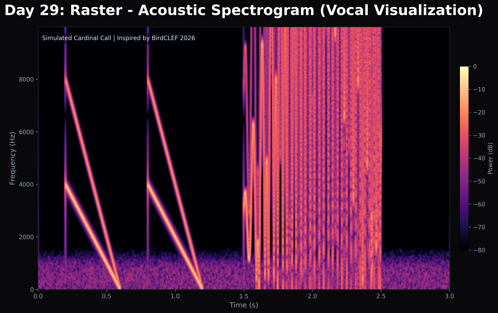

# Day 29: Raster
Pushing the boundaries of the challenge, this is an **Acoustic Raster**—a spectrogram visualizing the vocalizations of a bird over time. This approach, heavily utilized in machine learning competitions like **BirdCLEF 2026**, represents time on the X-axis, frequency on the Y-axis, and amplitude via color intensity (magma colormap). The signal features simulated frequency sweeps and a rapid trill characteristic of many songbirds, superimposed over low-frequency background noise.

## Visualization

