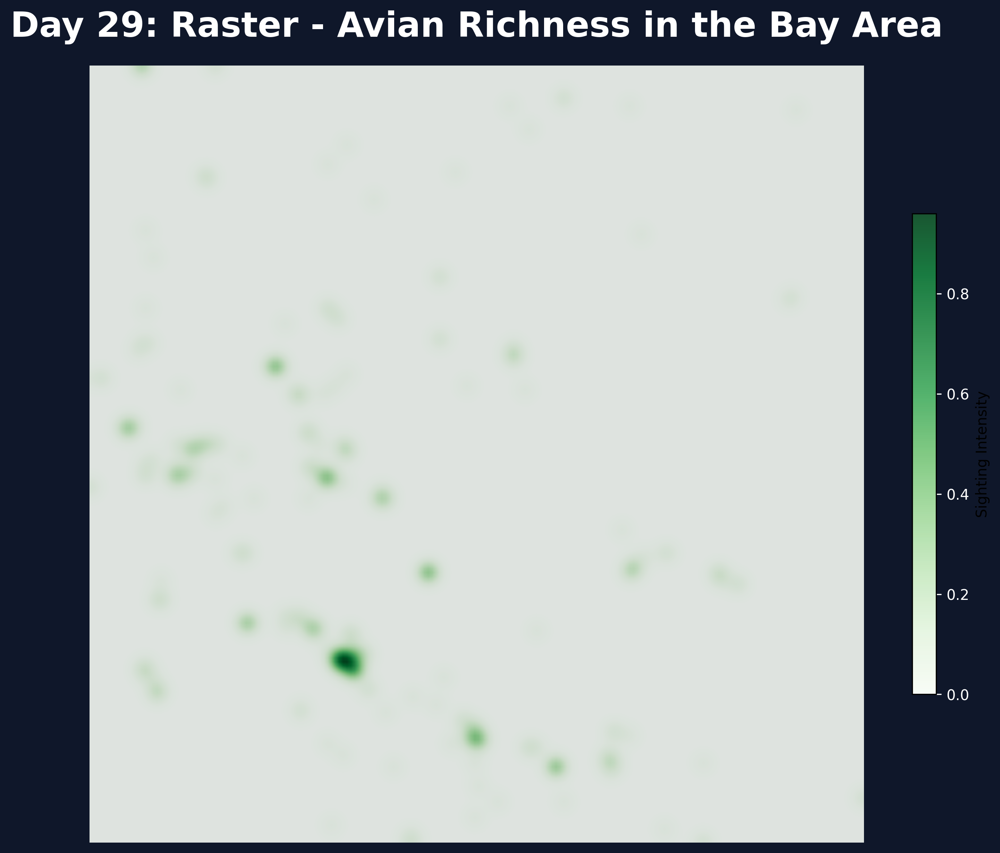

# Day 29: Raster
A continuous intensity surface (raster) of bird sightings across the San Francisco Bay Area. This map uses Gaussian smoothing on binned point data from GBIF to visualize regional "hotspots" of avian activity as a continuous field of biodiversity.

## Visualization

