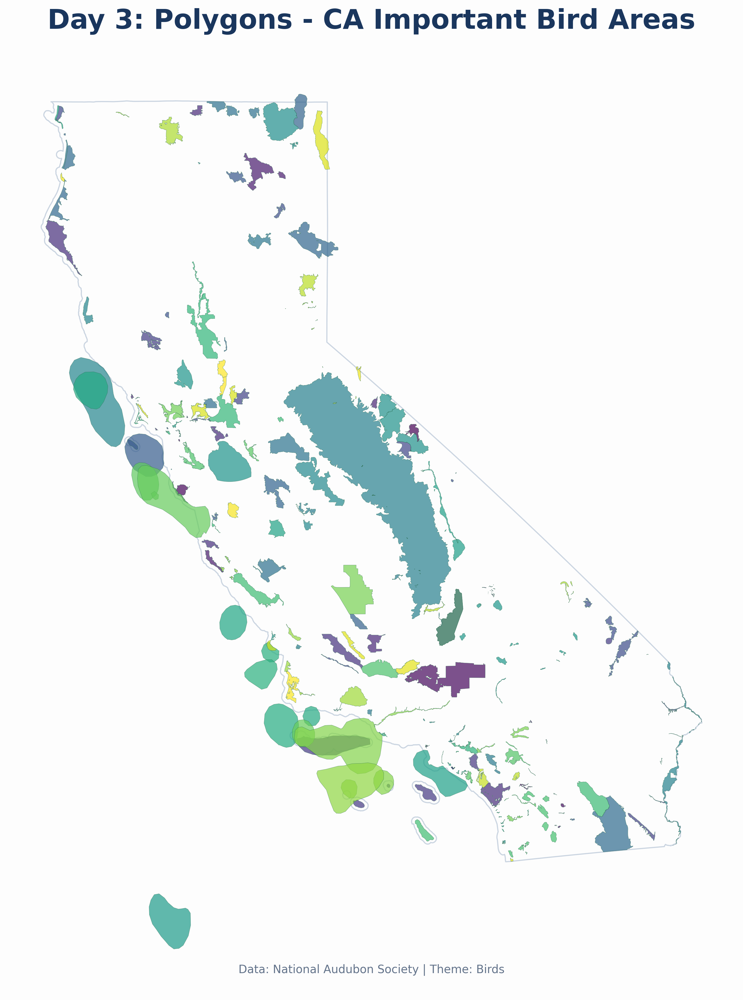

# Day 3: Polygons
A map of the **Important Bird Areas (IBAs)** in California. IBAs are sites that provide essential habitat for one or more species of breeding, wintering, or migrating birds. Data provided by the National Audubon Society.

## Visualization

