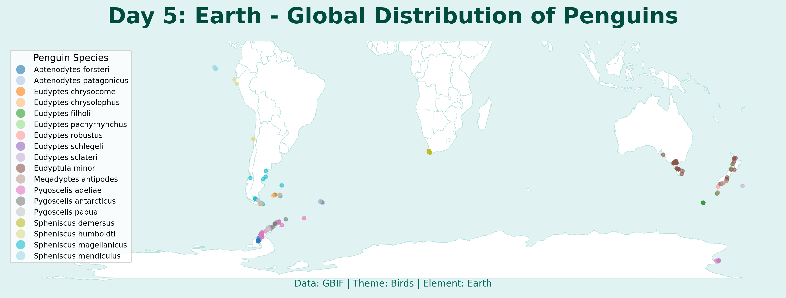

# Day 5: Earth (Classical Elements 1/4)
A global distribution map of penguins (family *Spheniscidae*). Being flightless and terrestrial during breeding, penguins are uniquely tied to the earth and southern oceans. Data sourced from GBIF sightings.

## Visualization

