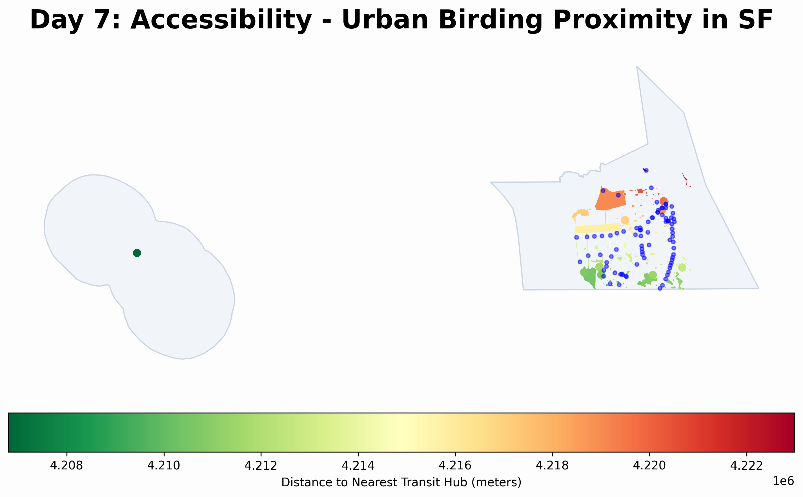

# Day 7: Accessibility
A map analyzing the accessibility of birding spots (parks and nature reserves) in San Francisco relative to major transit hubs (BART and MUNI stations). Regions in green are within easy walking distance of a station, promoting car-free urban birding.

## Visualization

