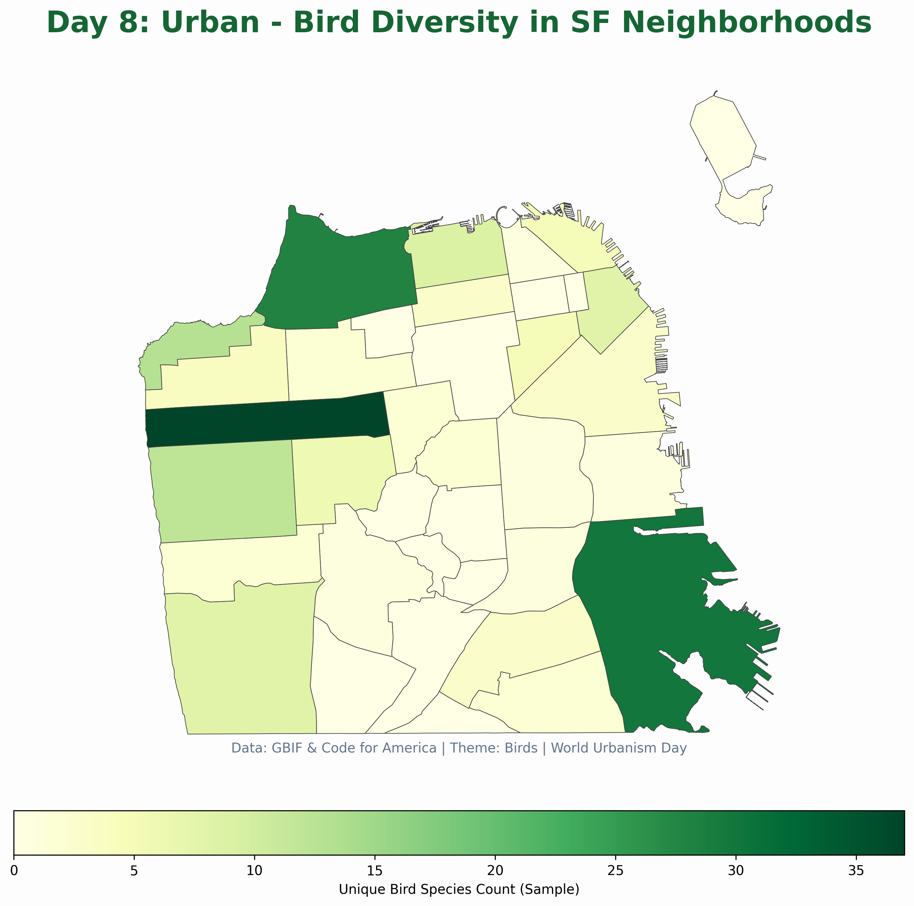

# Day 8: Urban
A choropleth map showing the diversity of bird species found in different San Francisco neighborhoods. This visualization highlights the richness of urban biodiversity, calculated by counting unique species sightings from a sample of GBIF data within each administrative boundary.

## Visualization

