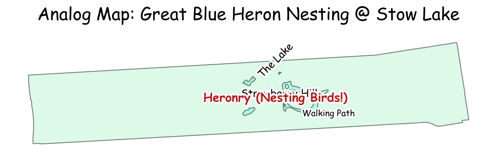

# Day 9: Analog
A "hand-drawn" sketch map of the Great Blue Heron nesting site (heronry) at Stow Lake in San Francisco's Golden Gate Park. Using the XKCD style to evoke an analog, field-note aesthetic.

## Visualization

